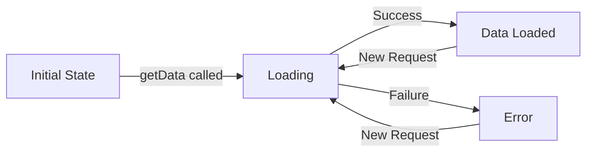

Composables are reusable functions that leverage Vue's Composition API to encapsulate and share stateful logic across components.

## What are Composables?

<Card title="Composables" icon="puzzle-piece">
  Composables are JavaScript functions that:
  - Use Vue's Composition API (ref, computed, watch, etc.)
  - Encapsulate reusable reactive logic
  - Can be shared across multiple components
  - Follow the `use*` naming convention
</Card>

## useGetData Composable

The `useGetData` composable handles HTTP requests using Axios:

```javascript src/composables/useGetData.js
import axios from 'axios'
import { ref } from 'vue'

export const useGetData = () => {
  const datos = ref(null); // Null because we don't know what we'll receive
  const cargando = ref(true);
  const error = ref(false);

  const getData = async (url) => {
    try {
      // Wait to get results from the API
      const resultado = await axios.get(url);
      datos.value = resultado.data; // Axios always returns .data
    }
    catch (err) {
      // Log error to console
      console.log(err);
      error.value = true;
    } 
    finally {
      cargando.value = false;
    }
  };
  
  return {
    getData,  // Return the function
    datos,    // Return the result obtained
    error,
    cargando
  }
};
```

## Return Values

<AccordionGroup>
  <Accordion title="getData(url)">
    **Type:** `(url: string) => Promise<void>`
    
    **Description:** Async function that fetches data from the provided URL
    
    **Parameters:**
    - `url` - API endpoint to fetch from
    
    **Side Effects:**
    - Sets `datos.value` with response data
    - Sets `error.value` to `true` if request fails
    - Sets `cargando.value` to `false` when complete
  </Accordion>

  <Accordion title="datos">
    **Type:** `Ref<any | null>`
    
    **Description:** Reactive reference containing the API response data
    
    **Initial Value:** `null`
    
    **Usage:**
    ```vue
    <div v-if="datos">
      {{ datos.name }}
    </div>
    ```
  </Accordion>

  <Accordion title="error">
    **Type:** `Ref<boolean>`
    
    **Description:** Reactive reference indicating if the request failed
    
    **Initial Value:** `false`
    
    **Usage:**
    ```vue
    <div v-if="error" class="error">
      Error loading data
    </div>
    ```
  </Accordion>

  <Accordion title="cargando">
    **Type:** `Ref<boolean>`
    
    **Description:** Reactive reference indicating if the request is in progress
    
    **Initial Value:** `true`
    
    **Usage:**
    ```vue
    <div v-if="cargando" class="loading">
      Loading...
    </div>
    ```
  </Accordion>
</AccordionGroup>

## Usage in Components

### Basic Usage

```vue src/views/PokeView.vue
<script setup>
import { useRoute } from 'vue-router'
import { useGetData } from '@/composables/useGetData'

const route = useRoute()
const { getData, datos, error, cargando } = useGetData()

// Fetch Pokemon data when component mounts
getData(`https://pokeapi.co/api/v2/pokemon/${route.params.nombre}`)
</script>

<template>
  <div v-if="cargando" class="loading">
    <div class="spinner"></div>
    <p>Cargando información del Pokémon...</p>
  </div>

  <div v-else-if="error" class="error">
    <p>No se pudo cargar la información del Pokémon.</p>
  </div>   

  <div v-else class="pokemon-container">
    <h1>{{ datos.name }}</h1>
    <!-- Pokemon details -->
  </div>
</template>
```

### Multiple API Calls

You can create multiple instances of the composable:

```vue src/views/PokemonsView.vue
<script setup>
import { ref, onMounted } from 'vue'
import { useGetData } from '@/composables/useGetData'

const { getData, datos, error, cargando } = useGetData()
const offset = ref(0)
const limit = ref(20)

const fetchPokemons = () => {
  getData(`https://pokeapi.co/api/v2/pokemon?offset=${offset.value}&limit=${limit.value}`)
}

onMounted(() => {
  fetchPokemons()
})

const next = () => {
  offset.value += limit.value
  fetchPokemons()
}

const prev = () => {
  if (offset.value >= limit.value) {
    offset.value -= limit.value
    fetchPokemons()
  }
}
</script>
```

### Reactive Fetching

Fetch data reactively when parameters change:

```vue
<script setup>
import { ref, watch } from 'vue'
import { useGetData } from '@/composables/useGetData'

const searchQuery = ref('')
const { getData, datos, error, cargando } = useGetData()

// Re-fetch when search query changes
watch(searchQuery, (newQuery) => {
  if (newQuery) {
    getData(`https://pokeapi.co/api/v2/pokemon/${newQuery.toLowerCase()}`)
  }
})
</script>
```

## State Flow

The composable manages three states during the request lifecycle:



<AccordionGroup>
  <Accordion title="1. Initial State">
    ```javascript
    datos.value = null
    cargando.value = true
    error.value = false
    ```
  </Accordion>

  <Accordion title="2. Loading State">
    ```javascript
    // getData() called
    cargando.value = true  // Still true
    error.value = false    // Reset on new request
    ```
  </Accordion>

  <Accordion title="3. Success State">
    ```javascript
    datos.value = { ...apiResponse }
    cargando.value = false
    error.value = false
    ```
  </Accordion>

  <Accordion title="4. Error State">
    ```javascript
    datos.value = null  // Unchanged
    cargando.value = false
    error.value = true
    ```
  </Accordion>
</AccordionGroup>

## Template Patterns

Common template patterns when using `useGetData`:

### Loading, Error, Success

```vue
<template>
  <div v-if="cargando" class="loading">
    <div class="spinner"></div>
    <p>Cargando Pokémons...</p>
  </div>
  
  <div v-else-if="error" class="error">
    <p>Error al cargar los Pokémons.</p>
  </div>   
  
  <div v-else class="pokemon-grid">
    <div v-for="poke in datos.results" :key="poke.name">
      {{ poke.name }}
    </div>
  </div>
</template>
```

### With Empty State

```vue
<template>
  <div v-if="cargando">Loading...</div>
  <div v-else-if="error">Error occurred</div>
  <div v-else-if="!datos || datos.length === 0">No results found</div>
  <div v-else>
    <!-- Display data -->
  </div>
</template>
```

## Advantages of Composables

<Card title="Benefits" icon="thumbs-up">
  **Reusability**: Same logic can be used in multiple components
  
  **Organization**: Separates business logic from component templates
  
  **Testability**: Composables can be tested independently
  
  **Type Safety**: Works well with TypeScript
  
  **Flexibility**: Easy to customize and extend
</Card>

## Best Practices

<AccordionGroup>
  <Accordion title="Always Handle Loading States">
    Show feedback to users while data is loading:
    
    ```vue
    <div v-if="cargando" class="loading">
      <div class="spinner"></div>
      <p>Loading...</p>
    </div>
    ```
  </Accordion>

  <Accordion title="Always Handle Error States">
    Provide clear error messages when requests fail:
    
    ```vue
    <div v-if="error" class="error">
      <p>Failed to load data. Please try again.</p>
      <button @click="retry">Retry</button>
    </div>
    ```
  </Accordion>

  <Accordion title="Check Data Before Rendering">
    Use optional chaining and nullish coalescing:
    
    ```vue
    <template>
      <div>{{ datos?.name ?? 'Unknown' }}</div>
      <div v-if="datos?.results">
        <!-- Render results -->
      </div>
    </template>
    ```
  </Accordion>

  <Accordion title="Reset State on New Requests">
    Consider resetting error state when making new requests:
    
    ```javascript
    const getData = async (url) => {
      error.value = false  // Reset error
      cargando.value = true
      try {
        const resultado = await axios.get(url)
        datos.value = resultado.data
      } catch (err) {
        error.value = true
      } finally {
        cargando.value = false
      }
    }
    ```
  </Accordion>
</AccordionGroup>

## Extending useGetData

You can extend or modify the composable for specific needs:

### Adding Retry Logic

```javascript
export const useGetData = () => {
  const datos = ref(null)
  const cargando = ref(true)
  const error = ref(false)
  const retryCount = ref(0)
  const maxRetries = 3

  const getData = async (url) => {
    try {
      const resultado = await axios.get(url)
      datos.value = resultado.data
      retryCount.value = 0 // Reset on success
    } catch (err) {
      console.log(err)
      error.value = true
      
      if (retryCount.value < maxRetries) {
        retryCount.value++
        setTimeout(() => getData(url), 1000 * retryCount.value)
      }
    } finally {
      cargando.value = false
    }
  }

  return { getData, datos, error, cargando, retryCount }
}
```

### Adding Request Cancellation

```javascript
import axios from 'axios'
import { ref } from 'vue'

export const useGetData = () => {
  const datos = ref(null)
  const cargando = ref(true)
  const error = ref(false)
  let cancelToken = null

  const getData = async (url) => {
    // Cancel previous request if exists
    if (cancelToken) {
      cancelToken.cancel('New request initiated')
    }
    
    cancelToken = axios.CancelToken.source()
    
    try {
      const resultado = await axios.get(url, {
        cancelToken: cancelToken.token
      })
      datos.value = resultado.data
    } catch (err) {
      if (!axios.isCancel(err)) {
        error.value = true
      }
    } finally {
      cargando.value = false
    }
  }

  return { getData, datos, error, cargando }
}
```

## Next Steps

<CardGroup cols={2}>
  <Card title="Project Structure" icon="folder-tree" href="/architecture/project-structure">
    Learn about the codebase organization
  </Card>
  <Card title="State Management" icon="database" href="/architecture/state-management">
    Understand Pinia stores for global state
  </Card>
</CardGroup>